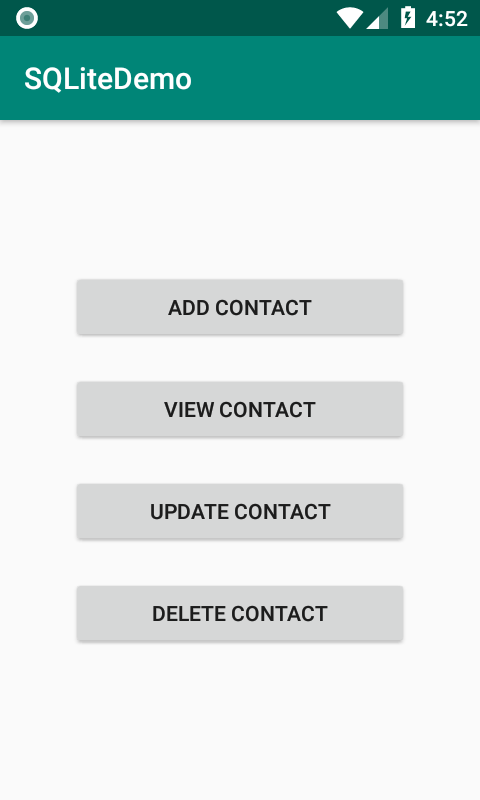
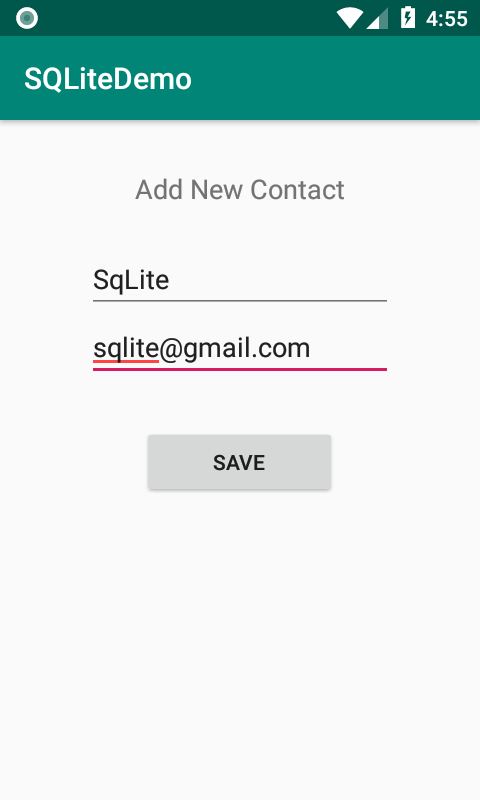
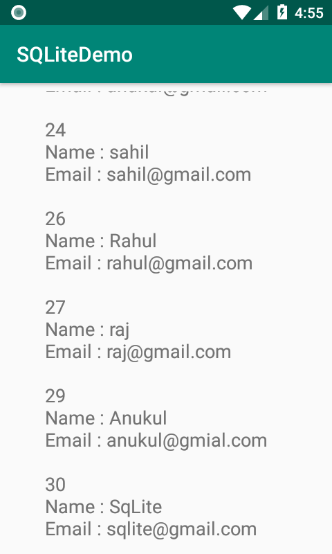
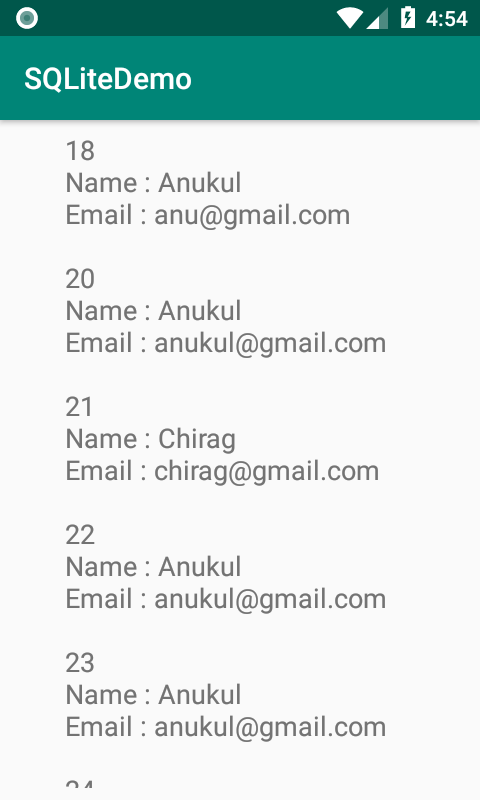
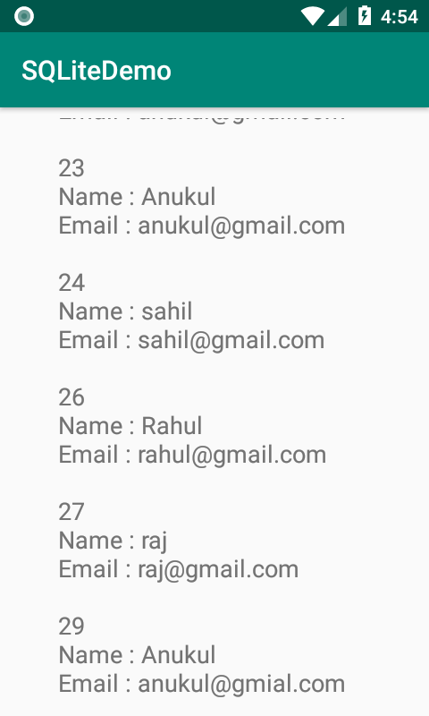
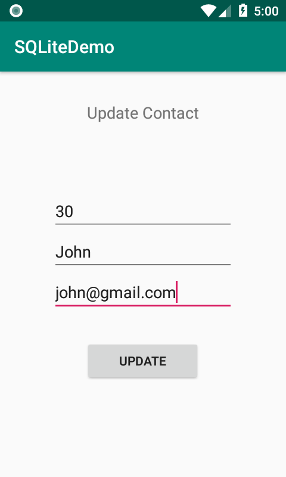
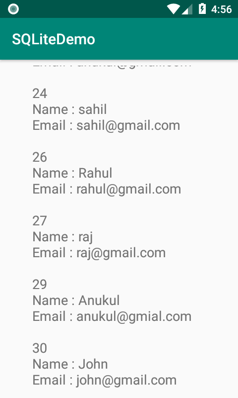
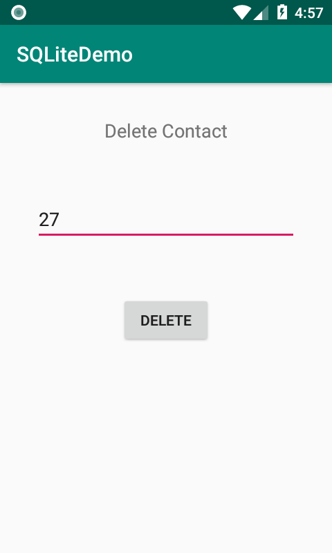
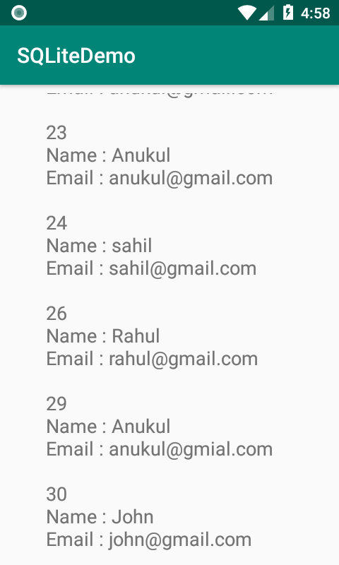

# Job-training-android
<h3>SQLiteDemo</h3>

<h4>activity_main.png</h4>

<h4>addNew_Contact.png</h4>

<h4>newContact_added.png</h4>

<h4>readContact.png</h4>

<h4>readContactData.png</h4>

<h4>update_Contact.png</h4>

<h4>contact_updated.png</h4>

<h4>delete_contact.png</h4>

<h4>contact_deleted.png</h4>

